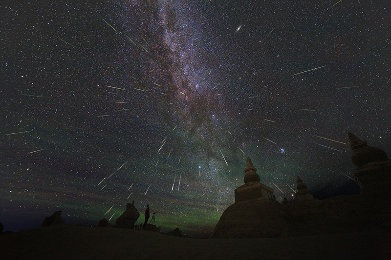
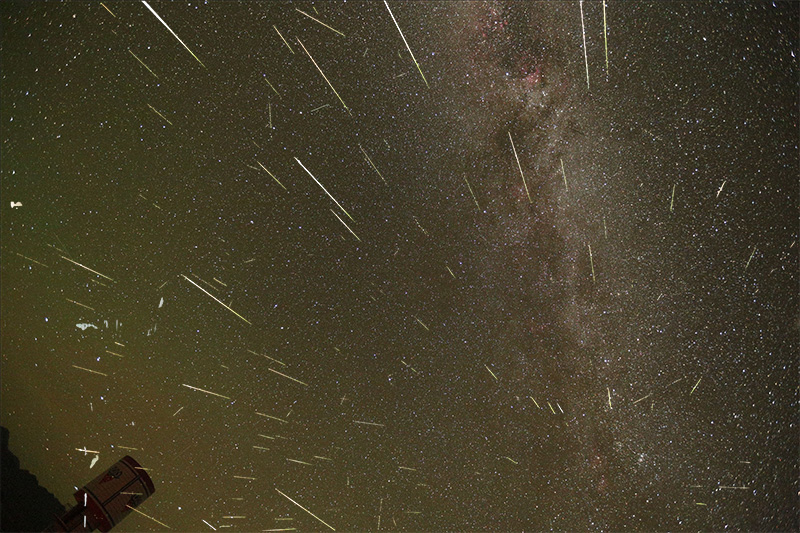

# One-click Meteor Shower!
Ok. One-click is the slogan, and the ultimate target. We are moving to that but yet...

Photographers who want to make a composition of meteor-shower image would all have the headache about the post-processing:
 - Need to check out the photos contain meteor captures, from hundreds of image files
 - Need to manually extract the meteor images from each photo, by using mask in image processing tools like Photoshop.

I had experienced this two times after shooting the Perseids. I want to get out of this boring task.

# Technique
The program contains 3 parts:
 1. Meteor object detection
 2. Meteor image mask generation
 3. Meteor image extraction

## Meteor object detection
Initially I had tried to use Deep learning technique for image object detection. However after I tried with the imageai and trained the model with about 150 meteor image samples, the result is failure. I am assuming if the loss function would need some change for such kind of object. Still need time to learning about that...

So I turned to use OpenCV as the figure of the meteor image is closed to a line.
The logic is:
 - Two images subtraction -> Blur -> Canny -> HoughLinesP

(Thanks for the suggestion from ### [LoveDaisy](https://github.com/LoveDaisy))

The corresponding parameters are tuned with the full size images from Canon 5D III and Canon 6D.

Detecting lines is not enough. Planes, maybe satellites, landscape objects could also be recognized as a line.

To try to recognize the satellite/plane objects, the algorithm is to compare two continuous images to look for lines with similar angle and distance (*the distance parameter would need further adjustment for different lens view* -- **TO DO #1**).

For landscape objects I have no way at this point, unless if I want to go for training an image recognition Neural Network.

In the test result I can detect quite a lot of satellites. But still there would be some left.

And for some very short meteors they could be missed in the detection.

Anyway I think the result is still acceptable.

For the"false detection", unrecognized satellites and landscape objects, a simple CNN neural network was trained to distinguish star backgrounds vs landscape objects. However this cannot solve all. The current alternative is to change to "two-clicks":

 1. Do the meteor detection process, stop and manually remove those false object files
 2. Resume with he 2nd script to extract the meteor objects

*(Scripts provided)*

## Meteor image mask generation

A U-NET Neural Network (learned from https://github.com/zhixuhao/unet) was trained to generate mask for the meteor object.

Due to my GPU limitation I can only train the network with 256x256 gray image samples. The generated mask files will be resized back. But need to further check if that's good enough.

***Update (2020-4-26):**   New method introduced. Big cropped images will be divided to several small pieces for mosaic. Small pieces images to be sent to the network to generate mask files. Then the mask files will be combined back to a big one.*

## Meteor image extraction

ImageChops.multiply() is used to extract the meteor object from the original photo with the mask. The extracted file is saved in PNG format with transparent background.

Finally the extracted meteor files can be combined to one.

(I manually added a black background for that)

And here's a composition with a star background

(I intentionally increased the brightness of the combined meteors for visible propose here)

**Known issue:**
**(Fixed in 2020-03-01 update)**
The border of the extracted meteor could be too deep. Still need to adjust the algorithm -- **TO DO #3 (done)**

## Suggestion to users

 1. First, use another software to do a star-alignment to the original images
 2. Put the aligned images to one folder
 3. Use the "two-clicks" scripts at this point. Also you can use the "auto_meteor_shower" script with option "detection"  for the first step, and then with option "extraction" for the 2nd step.

Run step example:
 - Step 1: auto_meteor_shower.py **detection** "folder name"
 - Step 2: Go to the "processed/03_filtered" folder, double check the detected images. Delete those you don't think are meteor objects
 - Step 3: auto_meteor_shower.py **extraction** "folder name" *(the folder name here is the same as that used in step 1)*

***Update (2020-5-17):**  One "equatorial_mount (Y/N)" option is added to the command line. Images taken with fixed tripod should choose "N" even though they are star-aligned. This can help the program to choose a bigger blur kernel size for object detection procedure.*

**The trained model weight files for the Neural Networks are put to Baidu cloud drive. Get the download info from the /saved_model/link.txt**