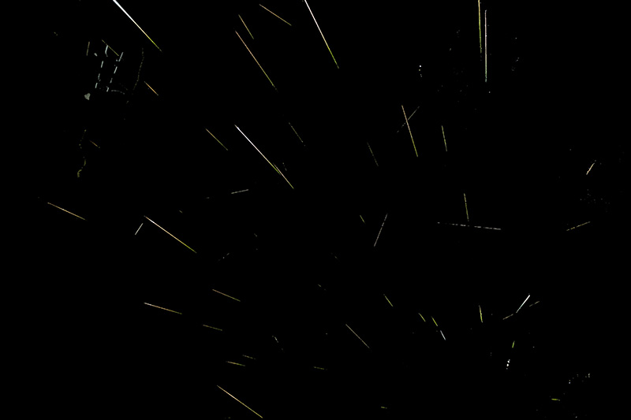
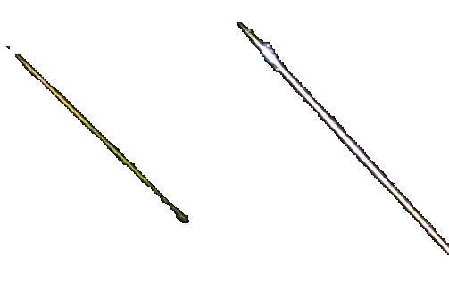

# One-click Meteor Shower!
Ok. One-click is the slogan, and the ultimate target. We are moving to that but yet...

Photographers who want to make a composition of meteor-shower image would all have the headache about the post-processing:
 - Need to check out the photos contain meteor captures, from hundreds of image files
 - Need to manually extract the meteor images from each photo, by using mask in image processing tools like Photoshop.

I had experienced this two times after shooting the Perseids. I want to get out of this boring task.

# Technique
The program contains 3 parts:
 1. Meteor object detection
 2. Meteor image mask generation
 3. Meteor image extraction

## Meteor object detection
Initially I had tried to use Deep learning technique for image object detection. However after I tried with the imageai and trained the model with about 150 meteor image samples, the result is failure. I am assuming if the loss function would need some change for such kind of object. Still need time to learning about that...

So I turned to use OpenCV as the figure of the meteor image is closed to a line.
The logic is:
 - Blur -> Canny -> HoughLinesP

The corresponding parameters are tuned with the full size images from Canon 5D III and Canon 6D.

It works on a certain level however in my test result it shows some problems:
 1. **Missing detection**. Dim meteors, short meteors, or meteors closed to the Milkyway, are difficult to be detected. If adjusting the parameters too aggressive the stars/Milkyway will be too much for detecting a line within them.
 2. **False detection**. Planes, maybe satellites (but lucky they are dim), landscape objects could also be recognized as a line. The most critical problem is that if the photo image is rotated for some degrees for star-alignment propose, the original edge would show some line characters and would be detected as well.

But I have to use this method first...

For "Missing detection", a solution is to try to introduce a tool to allow manually select the meteor object position and record it. -- **TO DO #1**

One more thing is to provide a tool to help to adjust the parameters. User can do some tuning according to their image.

For "False detection", two alternatives:
 - Train a Neural Network for image classification (this seems can work) -- **TO DO #2**
 - Change to "two-clicks". After finish the meteor detection process, stop and manually remove those false object files, and then resume -- scripts provided and use this at present

## Meteor image mask generation

A U-NET Neural Network (learned from https://github.com/zhixuhao/unet) was trained to generate mask for the meteor object.

Due to my GPU limitation I can only train the network with 256x256 gray image samples. The generated mask files will be resized back. But need to further check if that's good enough.

## Meteor image extraction

When the mask generated and resized/extended back to the original photo size, ImageChops.multiply() is used to extract the meteor object from the original photo with the mask. The extracted file is saved in PNG format with transparent background. This process is relatively slow in the algorithm I am using.

Finally the extracted meteor files can be combined to one.

(I manually added a black background for that)

**Known issue:**
The border of the extracted meteor is too deep. Still need to adjust the algorithm -- **TO DO #3**

## Suggestion to users

 1. When taking the photos, use equatorial mount for tracking as possible. Reduce the chance of needing to do star-alignment in post-processing
 2. Reduce the exposure time to make the background star/Milkyway to be dimmer. The background image can be taken separately
 3. Use the "two-clicks" scripts at this point

**The trained model weight file for the U-NET is put to Baidu cloud drive. Get the download info from the /saved_model/link.txt** 